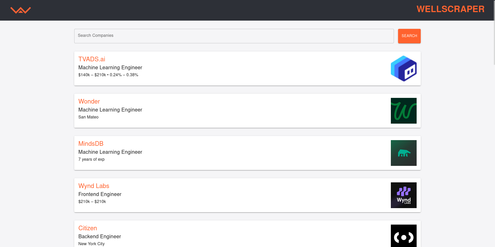

# Wellfound Webscraper

A scraper for wellfound jobs with a given job keyword.
It utilizes beatiful soup to scrape the data and React.JS to diplay it.
The server side operations are handled by FastAPI.

# Backend

The server side code consists of code to handle cors. In an ideal scenario allowed origins are specified but for the scope of this project, all origins are allowed.
 
Along with that there is a route to handle the data scraping and fetching.

Endpoint for scraping - http://127.0.0.1:8000/scrape

The request body should contain a keyword to search jobs in a domain.

https://wellfound.com/role/{keyword}

# Frontend

The frontend consists of a simple page which has an autocomplete component from MUI consisiting of searchable fields.
The requests are being made by axios which simplifies the data fetching process.